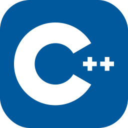

<h1 align="center">Hi there 👋, I'm Utsav</h1>
<!-- 
Fullstack Developer | Open Source Enthusiast
 -->

Hi everyone, I am Utsav Sutariya, student at Shree Ramkrishna Institute of Computer Education and Applied Sciences. I'm passionate about coding, learning new technologies, and building interesting projects.

<h3 align="center">My Technology Stack</h3>
<h3 align="left"> Languages </h3> 
     &nbsp
     &nbsp &nbsp
     &nbsp &nbsp
     &nbsp &nbsp

 
    
    
    
    

<h3 float="left">Connect with me 📝</h3>

    
    
    

